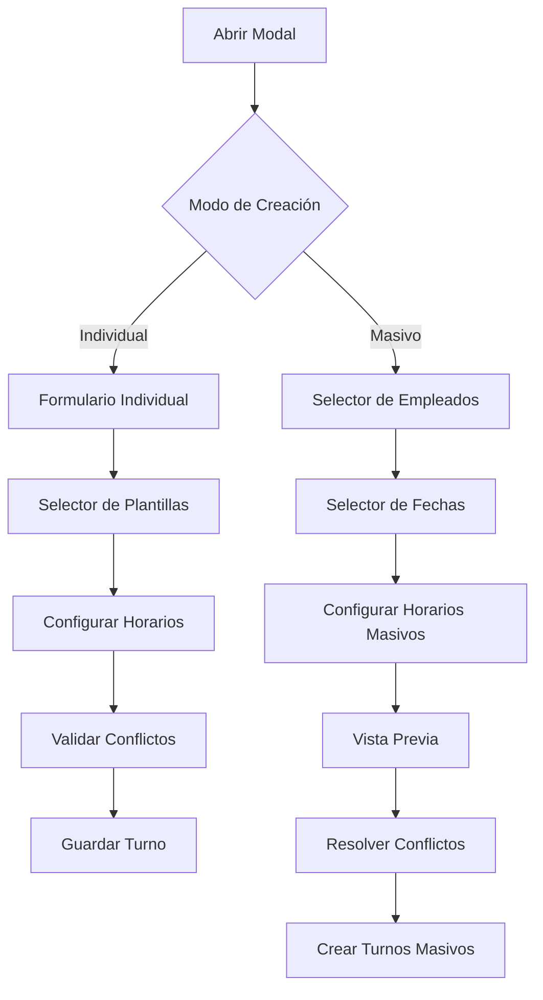

# Mejoras del Modal de Gestión de Turnos

## 1. Descripción General del Proyecto

Mejorar el modal de creación y edición de turnos para incluir funcionalidad de creación masiva, selección de fechas predeterminadas y optimización del diseño visual. El objetivo es aumentar la eficiencia operativa permitiendo a los administradores crear múltiples turnos simultáneamente y utilizar plantillas predefinidas para agilizar el proceso.

## 2. Funcionalidades Principales

### 2.1 Roles de Usuario

| Rol | Método de Registro | Permisos Principales |
|-----|-------------------|---------------------|
| Administrador | Acceso directo del sistema | Crear, editar, eliminar turnos individuales y masivos |
| Supervisor | Asignación por administrador | Crear y editar turnos, acceso limitado a creación masiva |
| Empleado | Registro por invitación | Solo visualizar sus propios turnos |

### 2.2 Módulos de Funcionalidad

Nuestro sistema mejorado de gestión de turnos consistirá en las siguientes páginas principales:

1. **Modal de Turno Individual**: Creación y edición de turnos únicos con validación en tiempo real
2. **Modal de Creación Masiva**: Interfaz para crear múltiples turnos en fechas seleccionadas
3. **Selector de Plantillas**: Acceso rápido a plantillas predefinidas de turnos
4. **Calendario de Fechas**: Selector visual para múltiples fechas con presets comunes

### 2.3 Detalles de Páginas

| Página | Módulo | Descripción de Funcionalidad |
|--------|--------|-----------------------------|
| Modal Individual | Formulario básico | Seleccionar empleado, fecha única, horarios, notas. Validación de conflictos |
| Modal Individual | Selector de plantillas | Aplicar plantilla predefinida con un clic. Autocompletar horarios y configuraciones |
| Modal Masivo | Selector de empleados | Selección múltiple de empleados con filtros por rol y disponibilidad |
| Modal Masivo | Calendario de fechas | Selección visual de múltiples fechas con presets (semana laboral, mes completo, fechas personalizadas) |
| Modal Masivo | Configuración de horarios | Definir horarios únicos o por plantilla para todos los turnos seleccionados |
| Modal Masivo | Vista previa | Mostrar resumen de turnos a crear antes de confirmar. Detectar y resolver conflictos |
| Selector de Plantillas | Lista de plantillas | Mostrar plantillas disponibles con información de horarios y uso frecuente |
| Selector de Plantillas | Gestión rápida | Crear nueva plantilla desde el modal actual. Editar plantillas existentes |

## 3. Flujo Principal de Usuario

### Flujo de Creación Individual
1. Usuario abre modal de turno desde calendario o botón "Nuevo Turno"
2. Selecciona empleado y fecha
3. Opcionalmente aplica plantilla predefinida
4. Ajusta horarios y agrega notas
5. Sistema valida conflictos en tiempo real
6. Confirma y guarda turno

### Flujo de Creación Masiva
1. Usuario selecciona modo "Creación Masiva" desde el modal
2. Selecciona múltiples empleados usando filtros
3. Elige fechas usando calendario visual o presets
4. Define horarios (únicos o por plantilla)
5. Revisa vista previa con detección de conflictos
6. Resuelve conflictos si existen
7. Confirma creación masiva

## 4. Diseño de Interfaz de Usuario

### 4.1 Estilo de Diseño

- **Colores primarios**: Azul #3B82F6 (acciones principales), Gris #6B7280 (texto secundario)
- **Colores secundarios**: Verde #10B981 (confirmaciones), Rojo #EF4444 (errores), Amarillo #F59E0B (advertencias)
- **Estilo de botones**: Redondeados (border-radius: 6px) con efectos hover suaves
- **Tipografía**: Inter, tamaños 14px (texto base), 16px (títulos), 12px (etiquetas)
- **Layout**: Diseño en tarjetas con espaciado consistente de 16px, navegación por pestañas
- **Iconografía**: Lucide React icons, estilo minimalista y consistente

### 4.2 Diseño de Páginas

| Página | Módulo | Elementos de UI |
|--------|--------|-----------------|
| Modal Individual | Header | Título dinámico ("Nuevo Turno" / "Editar Turno"), botón cerrar, indicador de modo |
| Modal Individual | Formulario | Campos organizados en grid 2 columnas, labels flotantes, validación en tiempo real con iconos |
| Modal Individual | Plantillas | Dropdown con preview de horarios, botón "Aplicar", indicador de plantilla activa |
| Modal Masivo | Pestañas | Navegación por pasos: Empleados → Fechas → Horarios → Vista Previa |
| Modal Masivo | Empleados | Lista con checkboxes, filtros por rol, búsqueda, contador de seleccionados |
| Modal Masivo | Fechas | Calendario visual, botones preset ("Esta semana", "Próximo mes"), lista de fechas seleccionadas |
| Modal Masivo | Vista Previa | Tabla resumen, indicadores de conflictos con colores, botones de resolución |
| Selector Plantillas | Grid | Tarjetas de plantillas con horarios, frecuencia de uso, botón aplicar |

### 4.3 Responsividad

Diseño desktop-first con adaptación móvil. En dispositivos móviles, el modal ocupa pantalla completa con navegación optimizada para touch. Los selectores de fecha se adaptan a interfaces táctiles con botones más grandes.

## 5. Funcionalidades Técnicas Específicas

### 5.1 Selector de Fechas Predeterminadas
- **Presets rápidos**: "Hoy", "Mañana", "Esta semana", "Próxima semana", "Este mes"
- **Calendario visual**: Selección múltiple con indicadores de días laborales
- **Fechas personalizadas**: Rango de fechas con validación de límites
- **Exclusión inteligente**: Omitir automáticamente fines de semana y feriados

### 5.2 Creación Masiva de Turnos
- **Selección de empleados**: Filtros por departamento, rol, disponibilidad
- **Aplicación de plantillas**: Usar plantillas existentes para configuración rápida
- **Detección de conflictos**: Validación en tiempo real de solapamientos
- **Vista previa**: Resumen detallado antes de confirmar creación
- **Progreso de creación**: Indicador de progreso para operaciones masivas

### 5.3 Mejoras de UX
- **Autocompletado inteligente**: Sugerir horarios basados en patrones históricos
- **Validación en tiempo real**: Feedback inmediato sobre conflictos y errores
- **Shortcuts de teclado**: Navegación rápida con Tab, Enter, Escape
- **Estados de carga**: Indicadores claros durante operaciones asíncronas
- **Mensajes contextuales**: Tooltips y ayuda contextual para funciones avanzadas