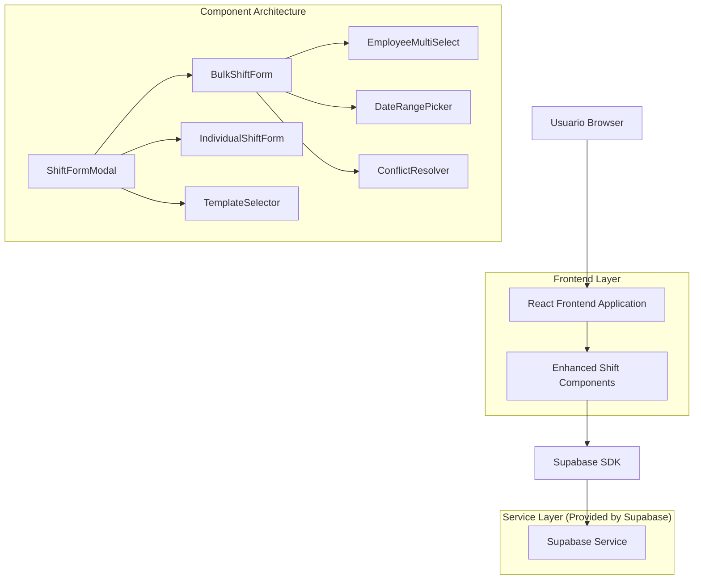
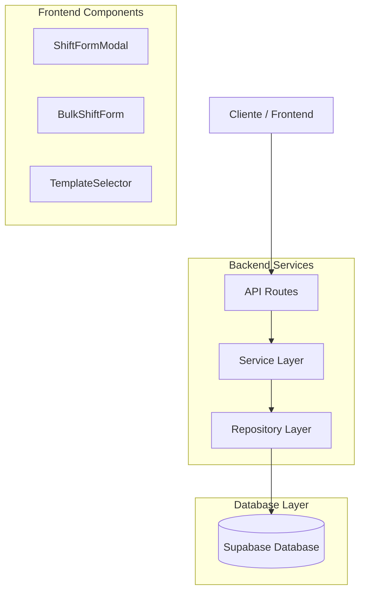
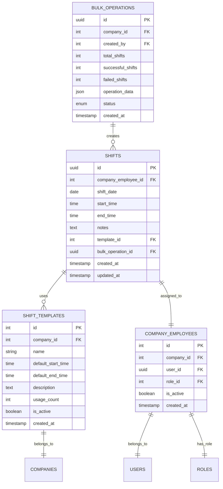

# Arquitectura Técnica - Mejoras del Modal de Turnos

## 1. Diseño de Arquitectura



## 2. Descripción de Tecnologías

- Frontend: React@18 + TypeScript + TailwindCSS@3 + Vite
- Backend: Supabase (PostgreSQL + Auth + Real-time)
- UI Components: Shadcn/ui + Lucide React
- State Management: Zustand + React Query
- Form Handling: React Hook Form + Zod validation
- Date Handling: date-fns + react-day-picker

## 3. Definiciones de Rutas

| Ruta | Propósito |
|------|----------|
| /dashboard | Dashboard principal con calendario de turnos |
| /dashboard/shifts | Vista detallada de gestión de turnos |
| /dashboard/templates | Gestión de plantillas de turnos |
| /dashboard/employees | Gestión de empleados y roles |

## 4. Definiciones de API

### 4.1 APIs Principales

**Creación masiva de turnos**
```
POST /api/shifts/bulk
```

Request:
| Parámetro | Tipo | Requerido | Descripción |
|-----------|------|-----------|-------------|
| employee_ids | number[] | true | IDs de empleados seleccionados |
| dates | string[] | true | Fechas en formato YYYY-MM-DD |
| start_time | string | true | Hora de inicio en formato HH:mm |
| end_time | string | true | Hora de fin en formato HH:mm |
| template_id | number | false | ID de plantilla a aplicar |
| notes | string | false | Notas adicionales |
| skip_conflicts | boolean | false | Omitir turnos con conflictos |

Response:
| Parámetro | Tipo | Descripción |
|-----------|------|-------------|
| created_count | number | Número de turnos creados exitosamente |
| conflicts | ConflictInfo[] | Lista de conflictos detectados |
| errors | string[] | Errores durante la creación |

Ejemplo:
```json
{
  "employee_ids": [1, 2, 3],
  "dates": ["2024-01-15", "2024-01-16", "2024-01-17"],
  "start_time": "09:00",
  "end_time": "17:00",
  "template_id": 5,
  "notes": "Turno de temporada alta"
}
```

**Validación de conflictos**
```
POST /api/shifts/validate-conflicts
```

Request:
| Parámetro | Tipo | Requerido | Descripción |
|-----------|------|-----------|-------------|
| shifts_data | ShiftValidationData[] | true | Datos de turnos a validar |

Response:
| Parámetro | Tipo | Descripción |
|-----------|------|-------------|
| conflicts | ConflictInfo[] | Conflictos detectados |
| suggestions | TimeSuggestion[] | Sugerencias de horarios alternativos |

**Gestión de plantillas**
```
GET /api/templates/shifts
POST /api/templates/shifts
PUT /api/templates/shifts/:id
DELETE /api/templates/shifts/:id
```

## 5. Arquitectura del Servidor



## 6. Modelo de Datos

### 6.1 Definición del Modelo de Datos



### 6.2 Lenguaje de Definición de Datos

**Tabla de Operaciones Masivas (bulk_operations)**
```sql
-- Crear tabla para operaciones masivas
CREATE TABLE bulk_operations (
    id UUID PRIMARY KEY DEFAULT gen_random_uuid(),
    company_id INTEGER NOT NULL REFERENCES companies(id),
    created_by INTEGER NOT NULL REFERENCES company_employees(id),
    total_shifts INTEGER NOT NULL DEFAULT 0,
    successful_shifts INTEGER NOT NULL DEFAULT 0,
    failed_shifts INTEGER NOT NULL DEFAULT 0,
    operation_data JSONB,
    status VARCHAR(20) DEFAULT 'pending' CHECK (status IN ('pending', 'processing', 'completed', 'failed')),
    created_at TIMESTAMP WITH TIME ZONE DEFAULT NOW(),
    updated_at TIMESTAMP WITH TIME ZONE DEFAULT NOW()
);

-- Crear índices
CREATE INDEX idx_bulk_operations_company_id ON bulk_operations(company_id);
CREATE INDEX idx_bulk_operations_created_by ON bulk_operations(created_by);
CREATE INDEX idx_bulk_operations_status ON bulk_operations(status);
CREATE INDEX idx_bulk_operations_created_at ON bulk_operations(created_at DESC);

-- Modificar tabla shifts para incluir bulk_operation_id
ALTER TABLE shifts ADD COLUMN bulk_operation_id UUID REFERENCES bulk_operations(id);
ALTER TABLE shifts ADD COLUMN template_id INTEGER REFERENCES shift_templates(id);

-- Crear índices adicionales
CREATE INDEX idx_shifts_bulk_operation_id ON shifts(bulk_operation_id);
CREATE INDEX idx_shifts_template_id ON shifts(template_id);

-- Mejorar tabla shift_templates
ALTER TABLE shift_templates ADD COLUMN usage_count INTEGER DEFAULT 0;
ALTER TABLE shift_templates ADD COLUMN is_active BOOLEAN DEFAULT true;
ALTER TABLE shift_templates ADD COLUMN color VARCHAR(7) DEFAULT '#3B82F6';

-- Función para actualizar usage_count automáticamente
CREATE OR REPLACE FUNCTION update_template_usage_count()
RETURNS TRIGGER AS $$
BEGIN
    IF NEW.template_id IS NOT NULL THEN
        UPDATE shift_templates 
        SET usage_count = usage_count + 1 
        WHERE id = NEW.template_id;
    END IF;
    RETURN NEW;
END;
$$ LANGUAGE plpgsql;

-- Trigger para actualizar contador de uso
CREATE TRIGGER trigger_update_template_usage
    AFTER INSERT ON shifts
    FOR EACH ROW
    EXECUTE FUNCTION update_template_usage_count();

-- Permisos para Supabase
GRANT SELECT ON bulk_operations TO anon;
GRANT ALL PRIVILEGES ON bulk_operations TO authenticated;
GRANT SELECT ON shift_templates TO anon;
GRANT ALL PRIVILEGES ON shift_templates TO authenticated;

-- Datos iniciales de plantillas
INSERT INTO shift_templates (company_id, name, default_start_time, default_end_time, description, color)
VALUES 
    (1, 'Turno Mañana', '08:00', '16:00', 'Turno estándar de mañana', '#10B981'),
    (1, 'Turno Tarde', '14:00', '22:00', 'Turno estándar de tarde', '#F59E0B'),
    (1, 'Turno Noche', '22:00', '06:00', 'Turno nocturno', '#6366F1'),
    (1, 'Medio Turno', '09:00', '13:00', 'Turno de medio día', '#8B5CF6');
```

## 7. Componentes de Frontend

### 7.1 Estructura de Componentes

```
src/components/shifts/
├── enhanced/
│   ├── EnhancedShiftFormModal.tsx
│   ├── BulkShiftForm.tsx
│   ├── EmployeeMultiSelect.tsx
│   ├── DateRangePicker.tsx
│   ├── ConflictResolver.tsx
│   └── ShiftPreview.tsx
├── templates/
│   ├── TemplateSelector.tsx
│   ├── TemplateQuickApply.tsx
│   └── TemplatePreview.tsx
└── common/
    ├── ShiftValidation.tsx
    ├── TimeInput.tsx
    └── ShiftStatusIndicator.tsx
```

### 7.2 Hooks Personalizados

```
src/hooks/shifts/
├── useBulkShiftCreation.ts
├── useShiftConflictValidation.ts
├── useShiftTemplates.ts
├── useDatePresets.ts
└── useShiftFormEnhancements.ts
```

### 7.3 Tipos TypeScript

```typescript
// Tipos para creación masiva
export interface BulkShiftData {
  employee_ids: number[];
  dates: string[];
  start_time: string;
  end_time: string;
  template_id?: number;
  notes?: string;
  skip_conflicts?: boolean;
}

// Tipos para validación de conflictos
export interface ConflictInfo {
  employee_id: number;
  date: string;
  existing_shift: Shift;
  conflict_type: 'overlap' | 'adjacent' | 'duplicate';
  severity: 'warning' | 'error';
}

// Tipos para presets de fechas
export interface DatePreset {
  id: string;
  name: string;
  dates: string[];
  description?: string;
}
```